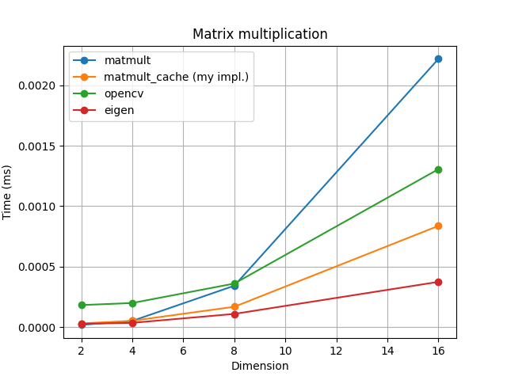
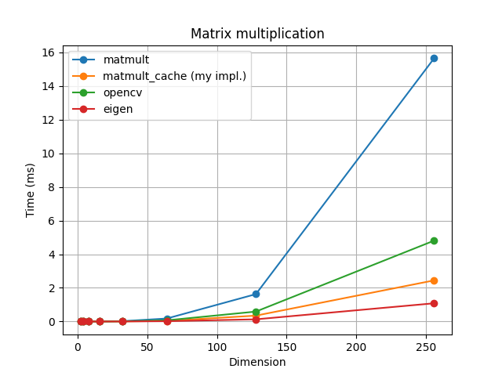

# FastMM

Fast Matrix Muliplication

## Explanation

Matrix Muliplication은 기본적으로 O(N^3) 의 시간복잡도가 소요되며, 이를 개선하기 위한 여러가지 알고리즘들이 제안되어 왔으나, 
가장 빠른 알고리즘 역시 O(N^2) 보다 느리다. (여기서 N은 matrix 의 dimmension)
그리고 이러한 이론적으로 빠른 알고리즘을 직접 구현해 보면 생각보다 속도가 크게 개선되지 않는다.
왜 그럴까? 이론과 현실사이의 차이는 프로그램의 메모리 사용에 의해 발생한다.
생각보다 메모리의 복사/할당/접근에 소요되는 시간이 프로그램의 수행시간에 많은 영향을 미친다.


따라서, 같은 O(N^3)의 시간 복잡도의 알고리즘이더라도 메모리 사용을 최적화하여 더 빠른 수행시간을 얻을 수 있다!

컴퓨터 프로그램은 메모리에 저장된 값을 사용하기 위해 사용하는 값과 그 근처의 메모리에 저장된 값을 한번에 가져와서(cache) 사용한다.
이때 가져온 값들은 아주 빠른 메모리에 저장하여 사용하며 매우 빠르다. 이러한 메모리 영역을 캐시 영역이라고 한다.
만약 캐시 영역에 필요로하는 값이 없다면 이러한 메모리 복사 과정을 다시 반복하며 추가적인 시간이 소요된다.
반대로 이러한 메모리 복사 과정을 줄일 수 있다면, 같은 알고리즘이라도 좀 더 효율적으로 동작하게 할 수 있다.

```C++
// a: m x k
// b: k x n
// c: m x n
for (size_t i1 = 0; i1 < m ; i1++)

    for (size_t i2 = 0; i2 < n ; i2++)
        for (size_t i3 = 0; i3 < k ; i3++)
            c[n * i1 + i2] += a[k * i1 + i3] * b[n * i3 + i2]

```

위와 같이 마지막 `for` 문에서 `i3`가 바뀌면서 `b` 에 접근하는 메모리의 영역이 `n`만큼 점프하게 되는데 `n`이 커지면 사용하는 메모리 사이의 거리가 멀어진다.
즉, 위에서 설명한 메모리 복사 과정이 빈번하게 발생하여 수행 시간을 길게 만든다.
이러한 점을 이용하여, 메모리 접근의 점프가 없어지도록 하면 아래와 같이 코드를 수정할 수 있다.

```C++
for (size_t i1 = 0; i1 < m ; i1++)
    for (size_t i3 = 0; i3 < k ; i3++)
        for (size_t i2 = 0; i2 < n ; i2++)
            c[n * i1 + i2] += a[k * i1 + i3] * b[n * i3 + i2]
```

위와 같이 두번째와 세번째의 `for` 문을 바꾸면 마지막 `for` 문에서 `i2` 가 바뀌면서 `c` 와 `b` 에 접근하는 위치를 가깝게 하여 캐시 사용 효율을 높일 수 있다.
비슷한 원리로 마지막 `for` 문에서 사용되는 `a[k * i1 + i3]` 를 local 변수로 선언하면 이역시 캐싱되어 속도 개선에 도움이 될 수 있다.

```C++
for (size_t i1 = 0; i1 < m ; i1++)

    for (size_t i3 = 0; i3 < k ; i3++)
    {
        float tmp = a[k * i1 + i3];
        for (size_t i2 = 0; i2 < n ; i2++)
            c[n * i1 + i2] += tmp * b[n * i3 + i2]
    }

```

위와 같이 작성한 코드는 matrix 의 크기가 작을때에는 큰 효과가 없지만 matrix의 크기가 커지면 커질수록 성능에 큰 차이를 발생시킨다.
아래 그래프는 matrix의 dimension의 크기를 다르게 하면서 수행 시간을 측정하여 시각화 한 것이다.



위 그림에서 `matmult` 은 맨 처음 구현된 matrix multiplication 알고리즘이고, `matmult_cache`는 위에서 제안한 메모리 사용을 개선한 알고리즘이다.
추가적으로 `OpenCV`, `Eigen` 라이브러리 사용시 성능도 함께 확인하였다.

위 그래프처럼 dimension이 아주 작을때(2~4)에는 큰 차이는 없지만 크기가 8만 되어도 캐싱을 이용한 알고리즘과의 속도 차이가 발생하는 것을 확인할 수 있다.



두번째 그래프를 보면 matrix 의 dimension이 더욱 커지면 성능 차이가 더욱 크게 발생하는 것을 확인할 수 있다.
`matmul_cache`가 영상처리에 주로 사용되는 `OpenCV` 보다도 빠른 속도로 연산이 되는 것을 확인할 수 있는데 동적 메모리 할당을 사용하는 `OpenCV`의 matrix 연산은 일반적인 다른 라이브러리보다도 matrix 연산 속도가 느린 것으로 알려져 있다. 특히 컴파일 최적화가 잘되어 있는 `Eigen`의 경우 `matmul_cache`보다도 훨씬 빠른 연산 속도를 보여주고 있는데, 이를 통해 메모리 사용 최적화, 컴파일 최적화 등이 프로그램 수행 속도에 많은 영향을 준다는 사실을 확인할 수 있다.

## Getting Started

* Dependencies
    * CMake
    * OpenCV
    * Eigen3

* Run
    ```shell
    mkdir build && cd build
    cmake ..
    make && ./fast_mm
    ```

* Results
    ```
    << benchmark: matmult >>
    dim: 2 elapsed time: 0.000018 [ms]
    dim: 4 elapsed time: 0.000051 [ms]
    dim: 8 elapsed time: 0.000342 [ms]
    dim: 16 elapsed time: 0.002218 [ms]
    dim: 32 elapsed time: 0.018694 [ms]
    dim: 64 elapsed time: 0.176169 [ms]
    dim: 128 elapsed time: 1.625773 [ms]
    dim: 256 elapsed time: 15.646681 [ms]
    << benchmark: matmult cache >>
    dim: 2 elapsed time: 0.000030 [ms]
    dim: 4 elapsed time: 0.000052 [ms]
    dim: 8 elapsed time: 0.000168 [ms]
    dim: 16 elapsed time: 0.000837 [ms]
    dim: 32 elapsed time: 0.004913 [ms]
    dim: 64 elapsed time: 0.034019 [ms]
    dim: 128 elapsed time: 0.348234 [ms]
    dim: 256 elapsed time: 2.442757 [ms]
    << benchmark: opencv >>
    dim: 2 elapsed time: 0.000182 [ms]
    dim: 4 elapsed time: 0.000199 [ms]
    dim: 8 elapsed time: 0.000360 [ms]
    dim: 16 elapsed time: 0.001306 [ms]
    dim: 32 elapsed time: 0.009087 [ms]
    dim: 64 elapsed time: 0.069120 [ms]
    dim: 128 elapsed time: 0.588789 [ms]
    dim: 256 elapsed time: 4.806176 [ms]
    << benchmark: eigen >>
    dim: 2 elapsed time: 0.000027 [ms]
    dim: 4 elapsed time: 0.000035 [ms]
    dim: 8 elapsed time: 0.000109 [ms]
    dim: 16 elapsed time: 0.000374 [ms]
    dim: 32 elapsed time: 0.002332 [ms]
    dim: 64 elapsed time: 0.017305 [ms]
    dim: 128 elapsed time: 0.128563 [ms]
    dim: 256 elapsed time: 1.081561 [ms]
    ```

## Environments
```
            .-/+oossssoo+/-.               kyungpyo@gp76 
        `:+ssssssssssssssssss+:`           ------------- 
      -+ssssssssssssssssssyyssss+-         OS: Ubuntu 20.04.4 LTS x86_64 
    .ossssssssssssssssssdMMMNysssso.       Host: GP76 Leopard 11UH REV:1.0 
   /ssssssssssshdmmNNmmyNMMMMhssssss/      Kernel: 5.11.0-27-generic 
  +ssssssssshmydMMMMMMMNddddyssssssss+     Uptime: 13 hours, 41 mins 
 /sssssssshNMMMyhhyyyyhmNMMMNhssssssss/    Packages: 2199 (dpkg), 10 (snap) 
.ssssssssdMMMNhsssssssssshNMMMdssssssss.   Shell: bash 5.0.17 
+sssshhhyNMMNyssssssssssssyNMMMysssssss+   Resolution: 1920x1080, 2560x1440 
ossyNMMMNyMMhsssssssssssssshmmmhssssssso   DE: GNOME 
ossyNMMMNyMMhsssssssssssssshmmmhssssssso   WM: Mutter 
+sssshhhyNMMNyssssssssssssyNMMMysssssss+   WM Theme: Adwaita 
.ssssssssdMMMNhsssssssssshNMMMdssssssss.   Theme: Orchis-Dark [GTK2/3] 
 /sssssssshNMMMyhhyyyyhdNMMMNhssssssss/    Icons: Tela [GTK2/3] 
  +sssssssssdmydMMMMMMMMddddyssssssss+     Terminal: gnome-terminal 
   /ssssssssssshdmNNNNmyNMMMMhssssss/      CPU: 11th Gen Intel i7-11800H (16) @ 
    .ossssssssssssssssssdMMMNysssso.       GPU: Intel Device 9a60 
      -+sssssssssssssssssyyyssss+-         GPU: NVIDIA 01:00.0 NVIDIA Corporati 
        `:+ssssssssssssssssss+:`           Memory: 9682MiB / 64023MiB 
            .-/+oossssoo+/-.
```